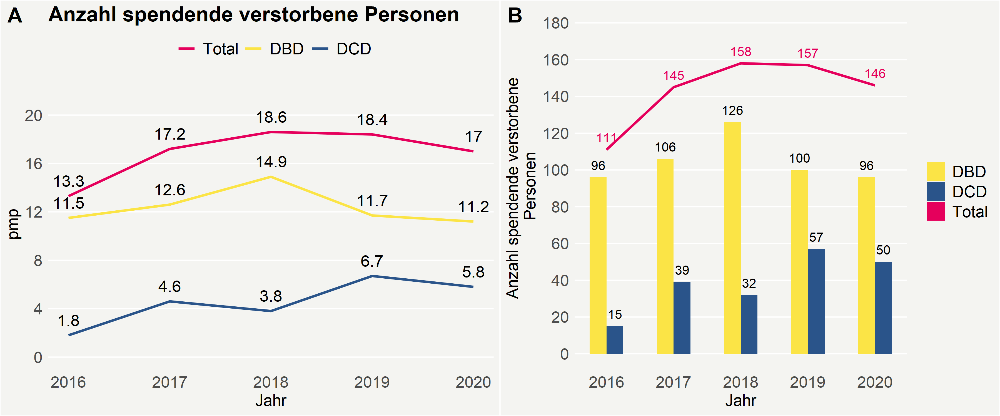

```{r setup, include=FALSE}
knitr::opts_chunk$set(echo = TRUE)
```

## Swisstransplant style graphics

This cookbook demonstrates the usage of the R package `stw` to make high-quality
publication-ready graphics in our in-house style using R's ggplot2 library a more
efficient and reproducible process.

The cookbook below shows how to make graphics like these: 



### Load libraries
```{r}
library(ggplot2)
library(reshape2)
library(swt)
```

### Create a SWT color object
```{r}
swtcol = swt_colors()
```


## Make a line Plot

### Example data from annual report
```{r}
# Data taken from Annual Report 2020 (p. 32)
table3.2 = t(array(c(
  13.3,17.2,18.6,18.4,17.0,
  11.5,12.6,14.9,11.7,11.2,
  1.8,4.6,3.8,6.7,5.8), dim = c(5,3)))

colnames(table3.2) = 2016:2020
rownames(table3.2) = c("Total", "DBD", "DCD")
table3.2
```

Create a `data.frame` for the plot.
```{r}
data3.2 = melt(table3.2, varnames = c("Gruppe", "Jahr"), value.name = "Anzahl")
```

### Plot using SWT style
```{r fig.height=4.5, fig.width=6}
number_height = -0.8

p.line = ggplot(data3.2, aes(x=Jahr, y=Anzahl, col=Gruppe, group=Gruppe)) +
  
  # plot line with numbers
  geom_line(data = data3.2, size=1) +
  geom_text(data = data3.2, aes(label=Anzahl), vjust=number_height,
            col="black", size=5) +
  
  # some adjustments (colors, axes, etc)
  scale_color_manual(values=c(swtcol$strongred.heart,
                              swtcol$yellow.organdonation,
                              swtcol$blue.swt)) +
  scale_y_continuous(breaks = seq(0,22,4), limits = c(0,22)) +
  
  ylab("pmp") +
  labs(title="Anzahl spendende verstorbene Personen"
       # subtitle = "Subtitle"
       ) +
  swt_style() + theme(legend.position = "top")
p.line
``` 

## Make a barplot with lines

### Example data from annual report
```{r}
# Data taken from Annual Report 2020 (p. 31)
table3.1 = t(array(c(
  96,106,126,100,96,
  15,39,32,57,50), dim = c(5,2)))

table3.1.totals = array(colSums(table3.1), dim = c(1,5))
colnames(table3.1) = 2016:2020
colnames(table3.1.totals) = 2016:2020
rownames(table3.1) = c("DBD", "DCD")
rownames(table3.1.totals) = c("Total")
table3.1
```

Create data.frame for the plot. Because the totlas are in a separate line plot, we
create a separate $data.frame$ accordingly.
```{r}
data3.1 = melt(table3.1, varnames = c("Gruppe", "Jahr"), value.name = "Anzahl")
data3.1.totals = melt(table3.1.totals, varnames = c("Gruppe", "Jahr"), value.name = "Anzahl")
```

### Plot
```{r fig.height=4.5, fig.width=6}
number_height = -0.8
bar_with = 0.5

p.barline = ggplot(data3.1, aes(x=Jahr, y=Anzahl, fill=Gruppe, group=Gruppe)) +
  
  # plot bars with numbers
  geom_bar(data = data3.1, stat="identity", position="dodge", width=bar_with) +
  geom_text(data = data3.1, aes(label=Anzahl), vjust=number_height,
            position = position_dodge(width=bar_with)) +

  # plot line with numbers
  geom_line(data = data3.1.totals, col = swtcol$strongred.heart, size=1) +
  geom_text(data = data3.1.totals, aes(label=Anzahl), vjust=number_height,
            position = position_dodge(width=bar_with), col=swtcol$strongred.heart) +
  
  # some adjustments (colors, axes, etc)
  scale_fill_manual(values=c(swtcol$yellow.organdonation, 
                             swtcol$blue.swt,
                             swtcol$strongred.heart)) +
  scale_y_continuous(breaks = seq(0,180,20), limits = c(0,180)) +
  ylab("Anzahl spendende verstorbene\n Personen") +
  swt_style() 

# ggsave(file="figure31.png", type="cairo-png")
p.barline
``` 

## Combining plots and subplots
```{r fig.height=5, fig.width=12}
cowplot::plot_grid(p.line, p.barline, nrow = 1, ncol = 2, labels = c("A", "B"),
                   label_size=18)
ggsave(file="swt_example_plots.png", type="cairo-png")
```

